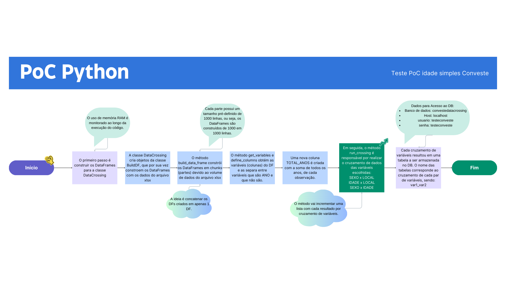

# teste-poc-idade-simples
- PoC em Python para cruzamento de dados de idade, local, sexo e ano.
- Ambiente Docker gravando dados em PostgreSQL

# Como executar o codigo
- Clone o repositorio.
- Com o Docker instalado na máquina, execute:
  - docker-compose build
  - docker-compose up

# Estrutura do código
## Objetivo
- O código deve ler um arquivo xlsx e fazer um cruzamento entre:
-- SEXO x LOCAL
-- LOCAL x IDADE
-- SEXO x IDADE

## Arquivo
- O arquivo é uma planilha no formato xlsx.
- Os dados válidos para cruzamento começam a partir da linha 6 (cabecalho)

## Classes
- A classe BuildDf reune os parâmetros necessários para criar o dataframe.
- O dataframe é criado em chunks para otimizar o desempenho.
- A classe DbConnect reune os métodos para conexão ao db PostgreSQL
- A classe DataCrossing cria os objetos da classe BuildDF e roda os cruzamentos de dados.
- A classe MemoryMonitor possui os metodos para monitorar o consumo de memoria na execução do código.

## Critérios
- O arquivo é carregado utilizando o openpyxl.
- Cada chunk_size corresponde ao tamanho da lista que constrói 1 dataframe.
- A lista de dataframes criada é concatenada em 1 dataframe final.

## Método
- Os cruzamentos são agrupamentos com a soma do valor total de anos para cada combinação.

### Cruzamento SEXO x LOCAL
- Significa que para cada sexo e local há um total de casos somados entre os anos 2000 e 2070.

### Cruzamento LOCAL x IDADE
- Significa que para cada individuo com certa idade em um local há um total de casos somados entre os anos 2000 e 2070.

### Cruzamento SEXO x IDADE
- Significa que para cada sexo de indivído e idade há um total de casos somados entre os anos de 2000 e 2070.

# Contexto
- O código usa a função groupby() do Pandas para agrupar as combinações
- O código usa a função agg() para somar os valores de todos os anos de cada cruzamento.
- O .reset_index() é usado para que a soma dos anos seja uma coluna normal e não um índice.

## O Padrão de projetos foi inspirado no Facade
- Ele é usado para fornecer uma interface simplificada para um sistema complexo, facilitando a interação com diversas classes e subsistemas internos.
- A ideia foi criar uma camada de abstração que facilite a manutenção, dado que cada classe tem sua finalidade estabelecida.
- Dividir as finalidades por classe permite uma manutenção mais direcionada, uma vez que se torna mais fácil identificar a causa do problema e corrigir diretamente na classe responsável.
- Os objetos permitem encapsular os métodos de cada classe, simplificando a interface para o usuário final e organizando o código por etapas.

## SOLID
- Single Responsibility Principle (SRP) – Princípio da Responsabilidade Única.
  - O SRP diz que uma classe deve ter uma única responsabilidade ou motivo para mudar.
  - Responsabilidades separadas em múltiplas classes:
    - DbConnect para conexão ao db.
    - DataCrossing para cruzar dados dos DFs.
    - MemoryMonitor para monitorar o uso de memória.
  - O código ficou mais modular e fácil de entender.
- Open/Closed Principle (OCP) – Princípio Aberto/Fechado
  - Uma classe deve estar aberta para extend e fechada para modificação.
    - DataCrossing pode ser extended.
    - DbConnect pode ser extended para outros dbs (MySQL, etc), podendo ainda substituir uma superclasse sem quebrar código (Liskov Substitution Principle (LSP) – Princípio da Substituição de Liskov)
- Interface Segregation Principle (ISP) – Princípio da Segregação de Interfaces
  - Uma classe não deve ser forçada a implementar métodos que não usa.
    - MemoryMonitor tem a única responsabilidade de monitorar o uso de memória sem estar sobrecarregada.

## Ponto desafiador
- Ler o arquivo xlsx e criar os DFs em chunks devido ao grande volume dados.
- Utilizar o Pandas da forma convencional para obter os dados do arquivo pode não ser a melhor solução.
- A abordagem utilizada foi ler o xlsx usando openpyxl.load_workbook, iterar linha por linha e criar o DF em chunks.
- Cada chunk contém 500(chunk_size) linhas.
- Cada DF criado em chunks possui 500 observações, que depois são concatenadas em 1 único DF final.

